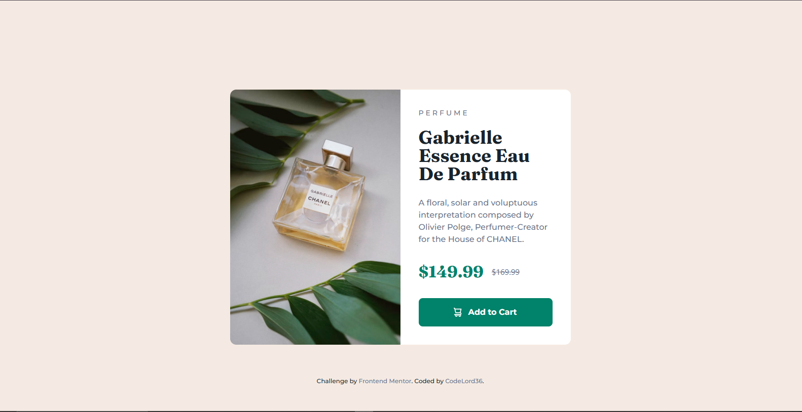
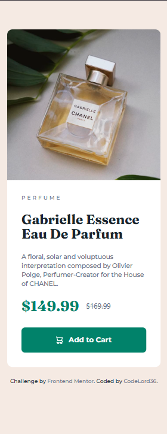

# 🛍️ Product Preview Card

A responsive product preview card built with **React, TypeScript, Vite, and Tailwind CSS**.

This project recreates a clean and modern product presentation interface featuring a product image, category label, product title, description, pricing information, and an add-to-cart action.

The project focuses on **responsive frontend development, component-based architecture, semantic HTML, utility-first styling, and maintainable React project structure**.

---

## 🌐 Live Demo

🚀 **[View Live Website](https://product-preview-card-one-khaki.vercel.app/)**

The project is deployed on **Vercel** and is available online for viewing and testing.

---

## 📸 Preview

### Desktop



### Mobile



---

## ✨ Features

- 📱 Responsive design for mobile and desktop screens
- 🧩 Component-based React architecture
- 🎨 Utility-first styling with Tailwind CSS
- 🛍️ Product information presentation
- 🖼️ Responsive product imagery
- 💰 Product pricing section
- 🛒 Add-to-cart action
- ♿ Semantic and accessible HTML structure
- 📐 Design-focused responsive layout
- 🎯 Accurate implementation of the provided design specification
- ⚡ Fast development workflow with Vite
- 🚀 Production-ready build configuration

---

## 🛠️ Technologies

| Technology       | Purpose                              |
| ---------------- | ------------------------------------ |
| **React**        | Building the user interface          |
| **TypeScript**   | Static typing and safer development  |
| **Vite**         | Development server and build tooling |
| **Tailwind CSS** | Utility-first responsive styling     |
| **ESLint**       | Code quality and linting             |
| **Vercel**       | Production deployment                |

The project currently uses **React 19, TypeScript 6, Vite 8, and Tailwind CSS 4**.

---

## 🧱 Component Architecture

The application is divided into focused React components instead of placing the entire interface inside one component.

```text
App

│

├── Card

│

└── Footer
```

The main `App` component composes the `Card` and `Footer` components into the final page layout.

This approach keeps the code easier to understand, maintain, and extend as the application grows.

---

## 📁 Project Structure

```text
product-preview-card/

│

├── public/

│

├── src/

│   │

│   ├── assets/

│   │

│   ├── components/

│   │   ├── Card/

│   │   └── Footer/

│   │

│   ├── App.tsx

│   ├── index.css

│   └── main.tsx

│

├── index.html

├── eslint.config.js

├── package.json

├── package-lock.json

├── style-guide.md

├── tsconfig.json

├── tsconfig.app.json

├── tsconfig.node.json

├── vite.config.ts

└── README.md
```

The repository separates the main application, reusable components, assets, and global styling into dedicated areas.

---

## 🎨 Styling Approach

The project uses **Tailwind CSS** to handle the visual styling and responsive layout.

Instead of maintaining a large collection of traditional CSS or SCSS files, utility classes are applied directly within the React components.

The styling approach focuses on:

- **Utility classes** — reusable Tailwind CSS utilities for layout and visual styling
- **Responsive utilities** — adapting the interface across different viewport sizes
- **Design tokens** — applying consistent colors, spacing, typography, and sizing
- **Component-level styling** — keeping styles close to the UI they control
- **Responsive layouts** — using Tailwind breakpoints to adapt the card between mobile and desktop

The project uses the Tailwind CSS Vite integration provided by `@tailwindcss/vite`.

---

## 🎨 Design System

The implementation follows the provided Frontend Mentor style guide.

### Colors

| Color         | Value                |
| ------------- | -------------------- |
| **Green 500** | `hsl(158, 36%, 37%)` |
| **Green 700** | `hsl(158, 42%, 18%)` |
| **Black**     | `hsl(212, 21%, 14%)` |
| **Grey**      | `hsl(228, 12%, 48%)` |
| **Cream**     | `hsl(30, 38%, 92%)`  |
| **White**     | `hsl(0, 0%, 100%)`   |

### Typography

**Montserrat**

- 500
- 700

**Fraunces**

- 700

The design specification uses a **14px** base paragraph size.

---

## 📱 Responsive Design

The interface was designed to work across different viewport sizes, with particular attention to:

- Mobile layouts
- Desktop layouts
- Responsive product imagery
- Typography
- Content spacing
- Card dimensions
- Button sizing
- Image positioning
- Content hierarchy
- Readability across screen sizes

The original design specifications use:

- **Mobile:** 375px
- **Desktop:** 1440px

The implementation is intended to remain responsive across the full range of screen sizes rather than being restricted to these reference dimensions.

---

## 🚀 Getting Started

### Prerequisites

Make sure you have the following installed:

- [Node.js](https://nodejs.org/)
- npm

### 1. Clone the repository

```bash
git clone https://github.com/CodeLord36/product-preview-card.git
```

### 2. Navigate into the project

```bash
cd product-preview-card
```

### 3. Install dependencies

```bash
npm install
```

### 4. Start the development server

```bash
npm run dev
```

Vite will start the development server and provide a local URL for the application.

---

## 📦 Available Scripts

### Development

```bash
npm run dev
```

Starts the Vite development server.

### Production Build

```bash
npm run build
```

Runs TypeScript compilation and creates an optimized production build.

### Preview Production Build

```bash
npm run preview
```

Runs the production build locally for previewing.

### Lint

```bash
npm run lint
```

Runs ESLint against the project.

These scripts are defined in the project's `package.json`.

---

## 🧠 What I Learned

Building this project helped me strengthen several frontend development concepts.

### React

I practiced breaking a complete interface into smaller, focused React components rather than building the entire page inside one component.

### TypeScript

I continued working with TypeScript in a React environment and became more comfortable structuring a typed frontend project.

### Tailwind CSS

I practiced using Tailwind CSS to build responsive interfaces through utility classes instead of relying on traditional CSS or SCSS architecture.

This included working with:

- Responsive utilities
- Flexbox
- Spacing
- Typography
- Colors
- Sizing
- Borders and radius
- Component-level styling

### Responsive Design

I improved my understanding of how layouts need to adapt between mobile and desktop viewport sizes rather than simply scaling the desktop design down.

### Component Architecture

I learned that even a relatively small interface benefits from separating independent sections into focused components.

### Font Integration

One of the challenges during development was correctly loading and applying the project's custom typography. This helped me understand the relationship between external/local fonts, CSS, and Tailwind CSS configuration.

### Development Workflow

I also practiced the complete frontend workflow:

```text
Design

   ↓

Component Planning

   ↓

React Development

   ↓

Tailwind CSS Styling

   ↓

Responsive Testing

   ↓

Font & UI Debugging

   ↓

Linting

   ↓

Production Build

   ↓

Vercel Deployment
```

---

## 📚 Project Inspiration

This project was built as a frontend practice project based on the **Product Preview Card Component** challenge from Frontend Mentor.

The focus was not only on reproducing the visual design, but also on practicing:

- React component architecture
- Responsive CSS
- Tailwind CSS
- TypeScript
- Frontend project structure
- Typography
- Responsive layouts
- Production deployment

---

## 📌 Project Status

**Completed ✅**

The current version implements the product preview card interface with responsive styling and a component-based React structure.

Future development can focus on introducing additional product interactions, improving accessibility, optimizing assets, and expanding the component into a reusable product-card system.

---

## 👨‍💻 Author

### CodeLord36

Frontend developer building projects with modern web technologies and continuously improving software engineering skills.

**GitHub:**

[github.com/CodeLord36](https://github.com/CodeLord36)

**Project Repository:**

[github.com/CodeLord36/product-preview-card](https://github.com/CodeLord36/product-preview-card)

**Live Demo:**

[View Live Website](https://product-preview-card-one-khaki.vercel.app/)

---

## ⭐ Acknowledgements

Thanks to the **Frontend Mentor** community and the design resources that provided the inspiration and specifications for this project.

---

### Built using React, TypeScript, Vite & Tailwind CSS
